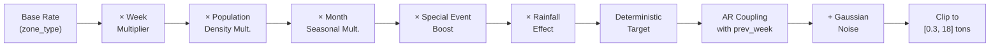

# Municipal Waste Dataset — Documentation

**Project:** R26-IT-126 — Machine Learning-Based Prediction of Municipal Wet and Dry Waste Generation  
**Generated:** 2026-05-04 | **Rows:** 3,000 | **Columns:** 10  
**File:** [municipal_waste_dataset.csv](file:///c:/Users/Minura/Desktop/ResearchProject/R26-IT-126/municipal_waste_dataset.csv)  
**Script:** [generate_dataset.py](file:///c:/Users/Minura/Desktop/ResearchProject/R26-IT-126/generate_dataset.py)

---

## 1. Synthetic Data Generation Logic

The dataset is generated using a **rule-based multiplicative model with autoregressive coupling and Gaussian noise**, not random sampling. Each row represents one zone's waste observation for a given week.

### Pipeline



### Key rules encoded

| Rule | Implementation |
|---|---|
| **Market → high wet waste** | `wet_base = 8.5` (highest of all zones) |
| **Residential → moderate wet** | `wet_base = 5.0` |
| **School → high dry waste** | `dry_base = 4.0 > wet_base = 2.5` |
| **Office → moderate dry** | `dry_base = 3.5`, `wet_base = 3.0` |
| **Tourist → increased dry** | `dry_base = 5.0` (highest dry) |
| **Festival → big wet boost** | `wet_mult = 1.55`, `dry_mult = 1.30` |
| **Holiday → moderate boost** | `wet_mult = 1.20`, `dry_mult = 1.15` |
| **Heavy rain → less dry** | Up to −12% dry collection |
| **High pop. density → more waste** | ×1.35 wet, ×1.30 dry |
| **Previous week → strong predictor** | AR coefficient 0.60 (wet), 0.55 (dry) |
| **Seasonal variation** | Wet peaks Jun–Aug; Dry peaks Nov–Jan |

### Noise & realism

- **Gaussian innovation** (σ = 0.6 wet, 0.45 dry) prevents perfect linearity
- **Rainfall** uses an exponential distribution with monsoon-month amplification
- **Clipping** ensures all values stay positive and within realistic municipal ranges

---

## 2. Summary Statistics

### Numeric Features

| Statistic | rainfall_mm | month | prev_wet_tons | prev_dry_tons | wet_waste_tons | dry_waste_tons |
|---|---|---|---|---|---|---|
| **count** | 3000 | 3000 | 3000 | 3000 | 3000 | 3000 |
| **mean** | 58.71 | 6.49 | 5.94 | 3.46 | 5.96 | 3.46 |
| **std** | 62.45 | 3.43 | 3.11 | 1.49 | 3.09 | 1.44 |
| **min** | 0.00 | 1 | 0.50 | 0.20 | 0.30 | 0.15 |
| **25%** | 14.30 | 4 | 3.64 | 2.42 | 3.68 | 2.48 |
| **50%** | 38.25 | 6 | 5.41 | 3.25 | 5.41 | 3.26 |
| **75%** | 80.70 | 9 | 7.57 | 4.31 | 7.57 | 4.24 |
| **max** | 300.00 | 12 | 15.00 | 10.00 | 18.00 | 10.29 |

### Categorical Feature Distributions

| zone_type | Count | % |
|---|---|---|
| residential | 1,052 | 35.1% |
| market | 591 | 19.7% |
| office | 549 | 18.3% |
| school | 451 | 15.0% |
| tourist_area | 357 | 11.9% |

| week_type | Count | % |
|---|---|---|
| normal | 2,144 | 71.5% |
| holiday | 512 | 17.1% |
| festival | 344 | 11.5% |

| population_density | Count | % |
|---|---|---|
| medium | 1,394 | 46.5% |
| high | 829 | 27.6% |
| low | 777 | 25.9% |

| special_event | Count | % |
|---|---|---|
| no | 2,546 | 84.9% |
| yes | 454 | 15.1% |

---

## 3. Correlation Overview

### Pearson Correlation Matrix (numeric columns)

|  | rainfall_mm | month | prev_wet | prev_dry | wet_waste | dry_waste |
|---|---|---|---|---|---|---|
| **rainfall_mm** | 1.000 | 0.137 | 0.116 | −0.149 | 0.118 | **−0.154** |
| **month** | 0.137 | 1.000 | 0.036 | 0.038 | 0.040 | 0.042 |
| **prev_wet_tons** | 0.116 | 0.036 | 1.000 | 0.047 | **0.971** | 0.059 |
| **prev_dry_tons** | −0.149 | 0.038 | 0.047 | 1.000 | 0.046 | **0.931** |
| **wet_waste_tons** | 0.118 | 0.040 | **0.971** | 0.046 | 1.000 | 0.058 |
| **dry_waste_tons** | **−0.154** | 0.042 | 0.059 | **0.931** | 0.058 | 1.000 |

### Key observations

> [!IMPORTANT]
> - **previous_wet_tons → wet_waste_tons** correlation = **0.971** (very strong, by design via AR coupling)
> - **previous_dry_tons → dry_waste_tons** correlation = **0.931** (very strong)
> - **rainfall_mm → dry_waste_tons** = **−0.154** (negative — heavy rain reduces dry collection)
> - **Wet and dry targets are nearly uncorrelated** (r = 0.058), making multi-output regression meaningful
> - Categorical features (zone_type, week_type, etc.) carry strong signal that won't appear in Pearson — tree models will capture these

### Mean Waste by Zone Type

| zone_type | wet_waste_tons | dry_waste_tons |
|---|---|---|
| **market** | **10.15** | 3.08 |
| residential | 6.14 | 2.61 |
| tourist_area | 5.64 | **5.43** |
| office | 3.77 | 3.70 |
| school | 3.01 | **4.09** |

> [!TIP]
> Notice how **market** zones dominate wet waste, while **school** and **tourist_area** zones generate more dry waste than wet — exactly matching the domain rules.

### Mean Waste by Week Type

| week_type | wet_waste_tons | dry_waste_tons |
|---|---|---|
| **festival** | **8.39** | **4.24** |
| holiday | 6.40 | 3.71 |
| normal | 5.47 | 3.28 |

---

## 4. Preprocessing Recommendations for ML

### 4.1 Encoding Categorical Variables

```python
# Option A: One-Hot Encoding (best for Linear Regression)
from sklearn.preprocessing import OneHotEncoder
cat_cols = ['zone_type', 'week_type', 'population_density', 'special_event']
encoder = OneHotEncoder(drop='first', sparse_output=False)

# Option B: Label/Ordinal Encoding (sufficient for tree-based models)
from sklearn.preprocessing import LabelEncoder
# population_density has natural order → use OrdinalEncoder
from sklearn.preprocessing import OrdinalEncoder
ord_enc = OrdinalEncoder(categories=[['low', 'medium', 'high']])
```

### 4.2 Feature Scaling

| Model | Scaling needed? |
|---|---|
| Linear Regression | **Yes** — StandardScaler or MinMaxScaler on numeric features |
| Random Forest | No — tree splits are scale-invariant |
| XGBoost | No — but scaling can help convergence speed |

```python
from sklearn.preprocessing import StandardScaler
num_cols = ['rainfall_mm', 'month', 'previous_wet_tons', 'previous_dry_tons']
scaler = StandardScaler()
```

### 4.3 Train/Test Split

```python
from sklearn.model_selection import train_test_split

X = df.drop(columns=['wet_waste_tons', 'dry_waste_tons'])
y_wet = df['wet_waste_tons']
y_dry = df['dry_waste_tons']

X_train, X_test, y_train, y_test = train_test_split(
    X, y_wet, test_size=0.2, random_state=42
)
```

### 4.4 Recommended Feature Engineering

| Feature | Rationale |
|---|---|
| `is_monsoon` = month ∈ {6,7,8,9} | Captures seasonal rainfall spike |
| `waste_ratio` = prev_wet / prev_dry | Captures zone behavior pattern |
| `heavy_rain` = rainfall > 100 | Binary threshold feature |
| `is_peak_waste` = festival or special_event | Combined event indicator |

### 4.5 Evaluation Metrics

For regression tasks on this dataset, use:
- **RMSE** (Root Mean Squared Error) — penalizes large errors
- **MAE** (Mean Absolute Error) — robust to outliers
- **R² Score** — proportion of variance explained
- **MAPE** (Mean Absolute Percentage Error) — interpretable for stakeholders

> [!NOTE]
> Since `previous_wet_tons` and `previous_dry_tons` are strong predictors (r > 0.93), even Linear Regression should achieve high R² on this dataset. The real challenge is whether models can capture the **categorical interaction effects** (zone × week × density) that drive the remaining variance.

---

## 5. Recommended Model Pipeline

```python
from sklearn.pipeline import Pipeline
from sklearn.compose import ColumnTransformer
from sklearn.ensemble import RandomForestRegressor
from xgboost import XGBRegressor
from sklearn.linear_model import LinearRegression

# Define preprocessing
preprocessor = ColumnTransformer(transformers=[
    ('num', StandardScaler(), num_cols),
    ('cat', OneHotEncoder(drop='first', sparse_output=False), cat_cols),
])

# Model pipelines
models = {
    'Linear Regression': Pipeline([('prep', preprocessor), ('model', LinearRegression())]),
    'Random Forest':     Pipeline([('prep', preprocessor), ('model', RandomForestRegressor(n_estimators=200, random_state=42))]),
    'XGBoost':           Pipeline([('prep', preprocessor), ('model', XGBRegressor(n_estimators=200, learning_rate=0.1, random_state=42))]),
}
```
